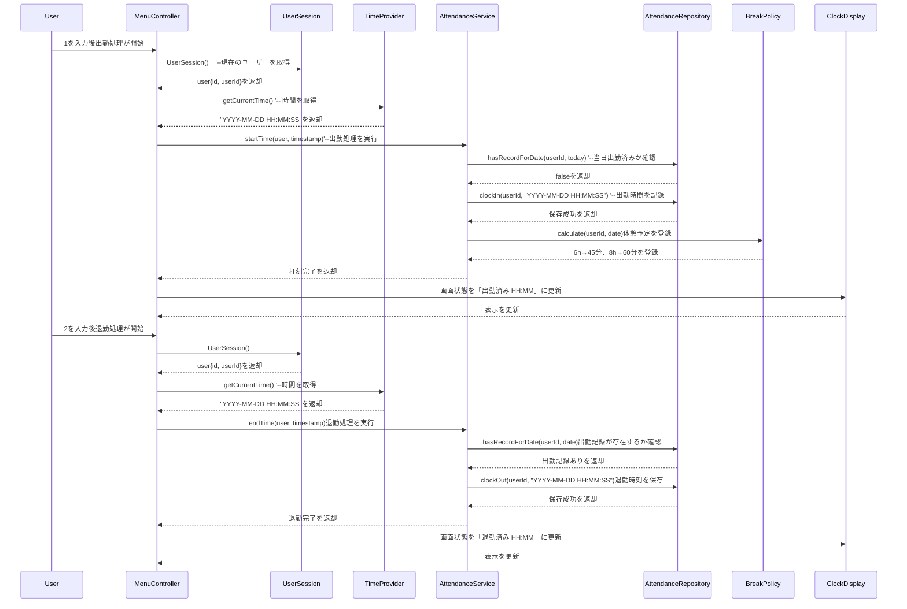

### 要件
- ログインできる
- メニュー画面で任意の数字を入力したら処理が行われる(例:出勤,1 退勤,2)
- 一定時間以上で休憩時間を自動設定(6時間で45分、8時間で合計1時間を自動カウント)
- 記録されている勤怠情報を編集できる
- 月ごとの勤怠記録一覧を表示させられる
- リアルタイムの時間を記録する
- リアルタイムで時間を表示させる
- 1日に何度も出勤できない
- 記録はCSVファイルに書き込まれる
- CSVファイルは個人によって異なる
- 隠しコマンドで現在時刻の更新を追加

### クラス設計

  | クラス名 | 主な責務 | 
|--------------------|----------------------------|
| AuthenticationService |出退勤のビジネスロジック。退勤時にAttendanceRecordを基に総労働時間を算出し、BreakPolicyを呼び出して休憩時間を確定| 
| UserSession | ログイン中ユーザーのセッション管理 | 
| TimeProvider | 現在時刻取得（モック差し替え可） | 
| ClockDisplay | リアルタイム時刻のコンソール／GUI 表示 | 
| BreakPolicy | 休憩時間算出ルール（6h→45分、8h→60分） | 
| finalizeDailyAttendance | 出退勤のビジネスロジック（1日1回チェック＋休憩付与） | 
| AttendanceRepository (or CsvRepo) | AttendanceRecordオブジェクトの永続化 | 
| MonthlyReportGenerator | 	AttendanceRepositoryからAttendanceRecordのリストを取得し、WorkTimeSummaryを生成して月次レポートを作成 | 
| MenuController | メニュー画面制御、各サービス呼び出し | 
| WorkTimeSummary| 総労働時間、休憩時間、実労働時間などを保持 MonthlyReportGeneratorなどが利用し、複雑な計算ロジックを単純化 | 
| AttendanceRecord | userId, startTime, endTime等を保持するデータクラスを導入 勤怠記録の受け渡しがオブジェクト単位となり、堅牢性が向上| 

### シーケンス図
==クラス図に準拠する==メソッド()の部分は英語

